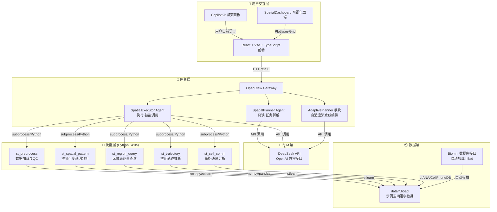

# BioAgent — 空间组学 AI 辅助平台 详细实施计划

> **项目定位：** 面向课程作业的空间组学数据分析智能体。前端 React + CopilotKit 提供聊天交互，OpenClaw 网关驱动 DeepSeek API 解析任务并调用 Python 技能，实现从自然语言到空间分析结果可视化的完整闭环。**核心策略：复用现有仓库源码，仅编写粘合代码（Glue Code）。**

---

## 目录

1. [架构总览](#1-架构总览)
2. [阶段 0：环境准备与仓库分析](#2-阶段-0环境准备与仓库分析)
3. [阶段 1：前端项目初始化](#3-阶段-1前端项目初始化)
4. [阶段 2：OpenClaw 网关与技能包](#4-阶段-2openclaw-网关与技能包)
5. [阶段 3：DeepSeek API 与多 Agent 配置](#5-阶段-3deepseek-api-与多-agent-配置)
6. [阶段 4：前后端联动](#6-阶段-4前后端联动)
7. [阶段 5：AdaptivePlanner 与增强功能](#7-阶段-5adaptiveplanner-与增强功能)
8. [阶段 6：测试、打磨与演示准备](#8-阶段-6测试打磨与演示准备)
9. [附录：关键文件清单](#附录关键文件清单)

---

## 1. 架构总览



### 数据流简述

1. 用户在 CopilotKit 聊天框输入自然语言（如"分析这个切片的空间高变基因"）
2. 前端通过 `VITE_OPENCLAW_API_URL` 将请求发送到 OpenClaw 网关
3. SpatialPlanner 解析意图，拆解为子任务序列
4. SpatialExecutor 按序调用 Python 技能，技能内部复用 stlearn/omicverse 逻辑
5. 技能返回 JSON 结果，前端 Plotly / ag-Grid 渲染可视化
6. AdaptivePlanner 可在模糊请求下自动编排"预处理→QC→分析"流水线

---

## 2. 阶段 0：环境准备与仓库分析

> **目标：** 确保所有依赖就绪，建立对复用仓库的清晰认知。

### 2.1 工作目录初始化

- [ ] **2.1.1** 在 `~/BioAgent/` 下创建目录结构：

```
BioAgent/
├── frontend/                 # React + Vite + CopilotKit
│   ├── src/
│   │   ├── pages/
│   │   ├── components/
│   │   ├── services/
│   │   └── types/
│   ├── public/
│   └── package.json
├── openclaw-gateway/         # OpenClaw 网关配置与技能
│   ├── config.yaml
│   ├── skills/
│   │   ├── st_preprocess/
│   │   ├── st_spatial_pattern/
│   │   ├── st_region_query/
│   │   ├── st_trajectory/
│   │   └── st_cell_comm/
│   └── planner/
│       └── adaptive_planner.py
├── data/                     # 示例数据（.h5ad / .csv）
├── scripts/                  # 辅助脚本（环境检查、数据下载等）
├── docs/                     # 文档
├── prompt.md                 # 已存在 - 项目提示词
└── plan.md                   # 本文件
```

- [ ] **2.1.2** 确认 conda 环境 `zf-li23` 中已有 Python 3.10+，安装下述 Python 包：

```bash
conda run -n zf-li23 pip install scanpy stlearn squidpy plotly pandas numpy \
    scikit-learn anndata leidenalg python-igraph louvain
```

- [ ] **2.1.3** 确认 Node.js ≥ 18 可用，安装 pnpm（openclaw 使用 pnpm）：

```bash
npm install -g pnpm
```

- [ ] **2.1.4** 下载最小示例数据：从 10x Genomics 获取 Mouse Brain Visium 切片（~50MB），放入 `data/`。若无法下载则用 `scanpy.datasets.visium_sge` 生成模拟数据。

### 2.2 关键仓库代码定位（已由探索报告完成 ✅）

| 复用目标 | 源仓库 | 关键路径 |
|:---|:---|:---|
| SKILL.md 模板 | ClawBio | `templates/SKILL-TEMPLATE.md` |
| 空间模式分析 | stLearn | `stlearn/tl/`、`stlearn/spatial/` |
| 空间绘图 | omicverse | `omicverse/pl/`、`omicverse/space/` |
| LangGraph Agent | SpatialAgent | `spatialagent/agent/spatialagent.py` |
| 多Agent路由 | OpenBioLLM | `openbiollm/src/core/rag.py`、`router.py` |
| 工具注册表 | Biomni | `biomni/tool/tool_registry.py` |
| LLM工厂 | Biomni | `biomni/llm.py` |
| 前端 Hooks | CopilotKit | `packages/react-core/src/hooks/` |
| DeepSeek 认证 | deepseek-v4-for-copilot | `src/auth.ts`、`src/client/` |
| 区域查询模式 | qust | `qust_scripts/llm.py` |

---

## 3. 阶段 1：前端项目初始化

> **目标：** 搭建 React + Vite + TypeScript 前端，集成 CopilotKit 聊天面板和 SpatialDashboard 可视化组件。

### 3.1 项目脚手架

- [ ] **3.1.1** 使用 Vite 初始化 React + TypeScript 项目：

```bash
cd ~/BioAgent/frontend
npm create vite@latest . -- --template react-ts
```

- [ ] **3.1.2** 安装核心依赖：

```bash
npm install @copilotkit/react-core @copilotkit/react-ui axios plotly.js-dist \
    react-plotly.js ag-grid-react ag-grid-community react-router-dom
npm install -D @types/react-plotly.js tailwindcss autoprefixer postcss
```

- [ ] **3.1.3** 配置 `tailwindcss` 和 `postcss`（现代化 UI）。

- [ ] **3.1.4** 创建 `.env` 文件：

```
VITE_OPENCLAW_API_URL=http://localhost:3000
VITE_DEEPSEEK_API_KEY=your_key_here
```

### 3.2 页面与组件开发

- [ ] **3.2.1** 创建 `src/pages/MainLayout.tsx`：左右分栏布局（左侧聊天面板 30%，右侧可视化面板 70%）。

- [ ] **3.2.2** 创建 `src/components/ChatPanel.tsx`：
  - 使用 `@copilotkit/react-ui` 的 `CopilotChat` 组件
  - 配置 `useCopilotChatSuggestions` 提供快捷指令（"分析空间高变基因"、"展示QC指标"、"寻找空间域"）
  - 添加"确认/修改"人机交互按钮（参考 SpatialAgent 的 HITL 模式）

- [ ] **3.2.3** 创建 `src/components/SpatialDashboard.tsx`：
  - 预留 3 个面板区域：空间可视化（Plotly 2D scatter）、基因表达热图（Plotly heatmap）、分析结果表格（ag-Grid）
  - 实现 Tab 切换（空间图 / 聚类UMAP / 热图 / 表格）
  - 支持图表导出为 PNG

- [ ] **3.2.4** 创建 `src/services/apiService.ts`：
  - 封装所有网关 API 调用
  - 定义 TypeScript 接口：`SpatialAnalysisRequest`、`SpatialAnalysisResponse`、`QCResult`、`SpatialPatternResult` 等

- [ ] **3.2.5** 创建 `src/types/spatial.ts`：集中定义所有空间组学数据类型。

- [ ] **3.2.6** 配置 React Router：`/` → MainLayout，`/dashboard` → SpatialDashboard。

### 3.3 参考源

| 参考内容 | 仓库路径 |
|:---|:---|
| CopilotKit 集成示例 | `repos/CopilotKit/examples/` |
| useCopilotChat / useCoAgent | `repos/CopilotKit/packages/react-core/src/hooks/` |
| 前端工具调用渲染 | `repos/CopilotKit/packages/react-core/src/hooks/useRenderToolCall.ts` |

---

## 4. 阶段 2：OpenClaw 网关与技能包

> **目标：** 搭建 OpenClaw 网关，创建 5 个空间组学 Python 技能，每个技能严格按照 ClawBio SKILL.md 规范编写。

### 4.1 OpenClaw 网关配置

- [ ] **4.1.1** 创建 `openclaw-gateway/config.yaml`：

```yaml
gateway:
  host: "0.0.0.0"
  port: 3000
  cors_origins: ["http://localhost:5173"]  # Vite dev server

llm:
  provider: deepseek
  model: deepseek-chat
  api_base: "https://api.deepseek.com/v1"
  api_key: "${DEEPSEEK_API_KEY}"
  temperature: 0.1
  max_tokens: 4096

skills:
  directory: "./skills"
  python_env: "zf-li23"  # conda 环境名
  timeout_seconds: 300

mcp:
  servers:
    - name: biomni_data
      command: python
      args: ["./skills/metadata_mcp/server.py"]
      env:
        DATA_DIR: "../data"

agents:
  spatial_planner:
    role: "只读规划者，负责分析用户意图并拆解为子任务序列"
    tools: []  # 只读，不调用技能
  spatial_executor:
    role: "执行者，拥有调用所有技能的权限"
    tools: ["st_preprocess", "st_spatial_pattern", "st_region_query", "st_trajectory", "st_cell_comm"]
```

- [ ] **4.1.2** 若 OpenClaw 本身过于复杂，则创建简化版 Python 网关 `openclaw-gateway/server.py`（使用 FastAPI）：

```python
# 简化网关架构：
# POST /chat  → 接收自然语言，调用 SpatialPlanner 规划
# POST /execute → 执行单个技能
# GET /skills  → 列出可用技能
# SSE /stream  → 流式返回分析结果
```

### 4.2 技能 1：`st_preprocess` — 数据加载与质控

- [ ] **4.2.1** 编写 `SKILL.md`（参考 `repos/ClawBio/templates/SKILL-TEMPLATE.md`）：

```yaml
---
name: st_preprocess
description: "读取 10x Visium 空间转录组数据，执行基本质控并返回 QC 指标"
license: MIT
metadata:
  version: "0.1.0"
  domain: spatial_transcriptomics
  tags: [preprocessing, qc, visium, 10x]
  inputs:
    - name: data_path
      type: string
      format: path
      description: "10x Visium 输出目录路径或 .h5ad 文件路径"
      required: true
  outputs:
    - name: qc_report
      type: object
      format: json
      description: "QC 指标 JSON（基因数、UMI数、线粒体比例、核糖体比例）"
  dependencies:
    python: ">=3.10"
    packages: [scanpy>=1.9, pandas>=2.0, numpy>=1.24]
  demo_data:
    - path: "../../data/visium_mouse_brain/"
      description: "10x Mouse Brain Visium 切片"
  endpoints:
    cli: "python skills/st_preprocess/run.py --data_path {data_path}"
    gateway: "POST /skills/st_preprocess"
  openclaw:
    requires: {bins: [python3]}
    always: false
    emoji: "🔬"
    install: [{kind: pip, package: scanpy}]
    trigger_keywords: ["加载数据", "质控", "QC", "预处理", "读入"]
---
```

- [ ] **4.2.2** 编写 `run.py`：核心逻辑直接调用 `scanpy.read_visium`，执行 `sc.pp.calculate_qc_metrics`，返回 JSON。输出示例：

```json
{
  "n_cells": 2696,
  "n_genes": 32285,
  "median_genes_per_cell": 1800,
  "median_umi_per_cell": 4500,
  "pct_mito": 5.2,
  "pct_ribo": 12.8,
  "spatial_coords_shape": [2696, 2]
}
```

- [ ] **4.2.3** 编写 `test_st_preprocess.py`：用模拟 AnnData 验证输出格式。

### 4.3 技能 2：`st_spatial_pattern` — 空间可变基因分析

- [ ] **4.3.1** 编写 `SKILL.md`，描述输入（h5ad 路径）、输出（SVG 列表 + Moran's I 值）。

- [ ] **4.3.2** 编写 `run.py`：复用 `repos/stLearn/stlearn/tl/` 的空间模式函数，或直接用 `squidpy.gr.spatial_neighbors` + `squidpy.gr.spatial_autocorr`（Moran's I）。

- [ ] **4.3.3** 输出 JSON：

```json
{
  "top_svg_genes": [
    {"gene": "Mbp", "moran_i": 0.82, "p_value": 0.001},
    {"gene": "Plp1", "moran_i": 0.78, "p_value": 0.001}
  ],
  "n_significant_genes": 245,
  "method": "morans_i",
  "n_spots": 2696
}
```

### 4.4 技能 3：`st_region_query` — 区域表达量查询

- [ ] **4.4.1** 编写 `SKILL.md`：给定空间坐标范围 + 基因名，返回该区域的平均表达量（参考 `repos/qust/` 的思路，但去除 GUI 依赖，改为纯函数）。

- [ ] **4.4.2** 编写 `run.py`：接收 `x_min, x_max, y_min, y_max, gene_list` 参数，在 AnnData 中切片查询。

- [ ] **4.4.3** 输出 JSON：

```json
{
  "region": {"x_range": [100, 200], "y_range": [150, 250]},
  "n_spots_in_region": 45,
  "gene_expression": {
    "Mbp": {"mean": 3.2, "std": 1.1},
    "Plp1": {"mean": 2.8, "std": 0.9}
  }
}
```

### 4.5 技能 4：`st_trajectory` — 空间轨迹推断

- [ ] **4.5.1** 编写 `SKILL.md`：描述如何设置根节点、计算空间伪时间（复用 `repos/stLearn/stlearn/spatial/trajectory/` 的 `pseudotimespace_global`）。

- [ ] **4.5.2** 编写 `run.py`：调用 stlearn 的轨迹函数，返回每个 spot 的伪时间和分支分配。

- [ ] **4.5.3** 输出 JSON：

```json
{
  "n_spots": 2696,
  "pseudotime_range": [0.0, 1.0],
  "n_branches": 3,
  "root_spot_index": 1200,
  "spots": [{"index": 0, "pseudotime": 0.12, "branch": "A"}, ...]
}
```

### 4.6 技能 5：`st_cell_comm` — 细胞通讯分析

- [ ] **4.6.1** 编写 `SKILL.md`：利用空间邻域信息推断配体-受体互作（复用 `repos/omicverse/omicverse/space/` 中的 `Commot` 集成或 LIANA）。

- [ ] **4.6.2** 编写 `run.py`：调用 LIANA 或 CellPhoneDB 的简化版，返回显著配体-受体对。

- [ ] **4.6.3** 输出 JSON：

```json
{
  "n_significant_pairs": 120,
  "top_interactions": [
    {"ligand": "Lgals9", "receptor": "Cd44", "score": 0.95},
    {"ligand": "Apoe", "receptor": "Lrp1", "score": 0.91}
  ],
  "method": "liana"
}
```

### 4.7 MCP 服务器：数据自动加载

- [ ] **4.7.1** 创建 `skills/metadata_mcp/server.py`：扫描 `data/` 目录下的所有 `.h5ad` 文件，提取元数据（shape、obs columns、var columns），通过 MCP 协议暴露给 LLM。

- [ ] **4.7.2** 参考 `repos/Biomni/biomni/config.py` 的 `BiomniConfig` 模式和 `repos/Biomni/biomni/tool/tool_registry.py` 的工具注册模式。

### 4.8 关键实现细节

- **Python 路径**：所有技能脚本头部添加：

```python
import sys, os
sys.path.insert(0, os.path.join(os.path.dirname(__file__), "../../../repos"))
```

- **conda 环境**：通过 `conda run -n zf-li23 python -u skills/.../run.py` 执行，保证 tqdm 实时输出。

- **最小数据策略**：使用 `scanpy.datasets.visium_sge()` 生成的模拟数据（~50 spots），不启动大规模矩阵运算。

---

## 5. 阶段 3：DeepSeek API 与多 Agent 配置

> **目标：** 配置 DeepSeek 作为默认 LLM，定义 SpatialPlanner 和 SpatialExecutor 两个 Agent 角色。

### 5.1 DeepSeek API 集成

- [ ] **5.1.1** 在 OpenClaw 网关中配置 DeepSeek 提供商（OpenAI 兼容接口）：

```python
# 参考 repos/Biomni/biomni/llm.py 的多提供商工厂模式
from openai import OpenAI

def get_deepseek_llm(api_key: str, model: str = "deepseek-chat"):
    return OpenAI(
        api_key=api_key,
        base_url="https://api.deepseek.com/v1"
    )
```

- [ ] **5.1.2** 实现 API Key 安全存储：参考 `repos/deepseek-v4-for-copilot/src/auth.ts` 的多层回退策略（环境变量 → 配置文件 → 交互式输入）。

### 5.2 Agent 角色定义

- [ ] **5.2.1** 创建 `SpatialPlanner` Agent（参考 `repos/OpenBioLLM/openbiollm/src/core/router.py` 的路由模式）：

```yaml
spatial_planner:
  system_prompt: |
    你是空间组学分析的规划专家。
    你的职责：
    1. 分析用户的自然语言请求，提取关键分析意图
    2. 将复杂请求拆解为有序的子任务序列
    3. 为每个子任务匹配合适的技能
    4. 输出结构化的执行计划（JSON格式）
    
    你只能进行规划，不能执行任何技能。执行由 SpatialExecutor 负责。
    
    可用技能清单：
    - st_preprocess: 数据加载与质控
    - st_spatial_pattern: 空间可变基因分析
    - st_region_query: 区域表达量查询
    - st_trajectory: 空间轨迹推断
    - st_cell_comm: 细胞通讯分析
    
    输出格式：
    {
      "plan": [
        {"step": 1, "skill": "st_preprocess", "args": {...}, "purpose": "..."},
        {"step": 2, "skill": "st_spatial_pattern", "args": {...}, "purpose": "..."}
      ],
      "explanation": "对用户请求的简要说明"
    }
  tools: []
```

- [ ] **5.2.2** 创建 `SpatialExecutor` Agent：

```yaml
spatial_executor:
  system_prompt: |
    你是空间组学分析的执行专家。
    你的职责：
    1. 接收 SpatialPlanner 的执行计划
    2. 按顺序调用指定的技能
    3. 收集每个步骤的结果
    4. 汇总生成最终的分析报告
    
    你必须严格按照计划顺序执行，上一步的输出会作为下一步的上下文。
  tools: ["st_preprocess", "st_spatial_pattern", "st_region_query", "st_trajectory", "st_cell_comm"]
```

- [ ] **5.2.3** 实现双 Agent 编排逻辑（参考 `repos/OpenBioLLM/openbiollm/src/core/rag.py` 的 LangGraph 图结构）：


### 5.3 评估器（Evaluator）质量门控

- [ ] **5.3.1** 在 SpatialExecutor 执行完成后加入评估节点（参考 OpenBioLLM 的 Evaluator），检查结果是否满足用户请求。若不满足，回退到 SpatialPlanner 重新规划。

---

## 6. 阶段 4：前后端联动

> **目标：** 实现前端聊天面板→网关→技能→可视化渲染的完整闭环。

### 6.1 API 服务封装

- [ ] **6.1.1** 完善 `src/services/apiService.ts`：

```typescript
// apiService.ts
import axios from 'axios';

const BASE_URL = import.meta.env.VITE_OPENCLAW_API_URL;

export interface ChatRequest {
  message: string;
  session_id?: string;
  data_path?: string; // 当前加载的 h5ad 路径
}

export interface ChatResponse {
  plan?: PlanStep[];
  results?: SkillResult[];
  explanation: string;
  visualization?: VisualizationData;
}

export interface PlanStep {
  step: number;
  skill: string;
  purpose: string;
  status: 'pending' | 'running' | 'completed' | 'failed';
}

export interface SkillResult {
  skill: string;
  output: Record<string, any>;
  error?: string;
}

// API 函数
export async function sendChat(request: ChatRequest): Promise<ChatResponse> { ... }
export async function executeSkill(skillName: string, args: Record<string, any>): Promise<SkillResult> { ... }
export async function listSkills(): Promise<string[]> { ... }
export async function listDatasets(): Promise<DatasetInfo[]> { ... }
```

### 6.2 ChatPanel 交互逻辑

- [ ] **6.2.1** 在 `ChatPanel.tsx` 中：
  - 用户发送消息 → 调用 `sendChat()` → 轮询/SSE 获取结果
  - 展示 SpatialPlanner 的规划节点（使用 `react-flow` 或简单列表）
  - 每个步骤完成后显示状态（✅ 已完成 / 🔄 进行中 / ❌ 失败）
  - 所有步骤完成后，将可视化数据传给 SpatialDashboard

- [ ] **6.2.2** 实现 CopilotKit 的 `useCopilotAction` 注册自定义操作：
  - `analyze_spatial`：触发完整分析流水线
  - `load_dataset`：切换数据集
  - `query_region`：区域查询

### 6.3 SpatialDashboard 可视化渲染

- [ ] **6.3.1** 空间 2D 散点图（Plotly）：根据 spot 坐标渲染切片，按基因表达量 or 聚类标签着色。

- [ ] **6.3.2** 聚类 UMAP 图：复用 `repos/omicverse/omicverse/pl/_embedding.py` 的绘图函数逻辑。

- [ ] **6.3.3** 基因表达热图（Plotly heatmap）：展示 Top N 高变基因 × 空间域的矩阵。

- [ ] **6.3.4** 分析结果表格（ag-Grid）：展示 SVG 列表、配体-受体对等表格数据。

### 6.4 人机交互（HITL）

- [ ] **6.4.1** 实现 ROI 点选修正（参考 `repos/SpatialAgent` 的 Hooks 系统）：在空间散点图上，用户可框选/点选区域，修改 AI 自动标注的 ROI，重新触发区域查询。

- [ ] **6.4.2** 实现"确认"按钮：在关键分析步骤（如设置伪时间根节点）之前，暂停并等待用户确认。

---

## 7. 阶段 5：AdaptivePlanner 与增强功能

> **目标：** 实现自适应规划模块，提升 Demo 展示层次。

### 7.1 AdaptivePlanner 模块

- [ ] **7.1.1** 创建 `openclaw-gateway/planner/adaptive_planner.py`：

```python
"""
AdaptivePlanner - 参考 Biomni 的 A1 智能体的 "env_desc" 感知思想
根据用户的模糊请求，自动组合技能形成分析流水线。
"""

ADAPTIVE_PLANNER_PROMPT = """
你是一个空间组学自适应分析规划器。

用户请求：{user_request}
可用数据集：{available_datasets}
可用技能：{available_skills}

请根据用户的模糊请求，自动构建分析流水线。
流水线节点类型：
- PROCESSING: 数据加载/预处理
- QC: 质量控制检查
- ANALYSIS: 核心分析（空间模式/轨迹/通讯）
- VISUALIZATION: 结果可视化

输出格式（JSON）：
{{
  "pipeline_name": "流水线名称",
  "stages": [
    {{"type": "PROCESSING", "skill": "st_preprocess", "purpose": "..."}},
    {{"type": "QC", "skill": "...", "purpose": "..."}},
    {{"type": "ANALYSIS", "skill": "...", "purpose": "..."}}
  ],
  "estimated_runtime_seconds": 30
}}
"""
```

- [ ] **7.1.2** 集成到 OpenClaw 网关：当用户请求模糊（无法匹配具体技能），自动路由到 AdaptivePlanner。

### 7.2 前端流水线可视化

- [ ] **7.2.1** 在 ChatPanel 中展示流水线节点（参考 `repos/Biomni` 的规划→执行流程）：

```tsx
// PipelineVisualizer.tsx
// 使用简单的 CSS 步骤条或 react-flow 展示 Processing → QC → Analysis → Visualization
// 当前阶段高亮 + 动画效果
```

### 7.3 可选加分功能

- [ ] **7.3.1** 多切片对比分析：加载两个切片，对比空间域分布差异。
- [ ] **7.3.2** 自然语言驱动的细胞类型标注：LLM 根据标记基因自动标注细胞类型。
- [ ] **7.3.3** 分析报告自动生成：汇总所有步骤结果，生成 Markdown 格式分析报告。
- [ ] **7.3.4** 结果持久化：将分析结果存入 `/tmp/bioagent_sessions/`，支持历史回顾。

---

## 8. 阶段 6：测试、打磨与演示准备

> **目标：** 端到端测试，UI 美化，准备课程演示。

### 8.1 测试

- [ ] **8.1.1** 单元测试：每个技能编写 `test_*.py`，使用 `pytest`，覆盖正常路径和边界条件。

- [ ] **8.1.2** API 测试：用 `curl` 或 Postman 测试网关每个端点。

- [ ] **8.1.3** 端到端测试：模拟完整用户对话：

```
用户: "加载 mouse brain 数据"
→ st_preprocess → 返回 QC 指标 → 前端展示表格

用户: "帮我找空间高变基因"
→ st_spatial_pattern → SVG 列表 → 前端热图

用户: "分析这个切片的空间轨迹"
→ st_trajectory → 伪时间 → 前端散点图着色
```

- [ ] **8.1.4** 前端组件测试：确保数据为空/加载中/错误状态都有合适 UI。

### 8.2 UI 打磨

- [ ] **8.2.1** 统一配色方案：生物信息学主题（深蓝 + 翠绿 + 白）。

- [ ] **8.2.2** 响应式布局：在 1366x768 以上分辨率正常显示。

- [ ] **8.2.3** 加载动画：技能执行中显示骨架屏/旋转动画。

- [ ] **8.2.4** 错误提示：网络错误、技能失败等情况给出友好的错误提示。

### 8.3 演示准备

- [ ] **8.3.1** 编写演示脚本（5 分钟）：
  1. 打开前端页面，展示初始 UI
  2. 加载示例数据集（mouse brain Visium）
  3. 输入"分析空间高变基因" → 展示规划→执行→可视化全流程
  4. 展示 ROI 点选修正的人机交互
  5. 展示自适应规划（模糊查询 → 自动编排流水线）

- [ ] **8.3.2** 准备可能的问题回答：
  - 为什么选择 DeepSeek 而不是本地模型？（无计算资源）
  - 如何使用现有仓库代码？（粘合代码模式）
  - 架构的可扩展性？（技能即插即用）

- [ ] **8.3.3** 录制演示视频（备用）。

---

## 附录：关键文件清单

### A. 前端文件（`frontend/`）

| 文件 | 功能 |
|:---|:---|
| `src/main.tsx` | 入口，挂载 React App |
| `src/App.tsx` | 路由配置 |
| `src/pages/MainLayout.tsx` | 左右分栏主布局 |
| `src/components/ChatPanel.tsx` | CopilotKit 聊天面板 |
| `src/components/SpatialDashboard.tsx` | 可视化面板（Plotly + ag-Grid） |
| `src/components/PipelineVisualizer.tsx` | 流水线步骤可视化 |
| `src/services/apiService.ts` | API 封装 |
| `src/types/spatial.ts` | 类型定义 |
| `src/index.css` | Tailwind 全局样式 |
| `.env` | 环境变量 |

### B. 网关文件（`openclaw-gateway/`）

| 文件 | 功能 |
|:---|:---|
| `config.yaml` | OpenClaw 配置（LLM、技能、MCP） |
| `server.py` | 简化版 FastAPI 网关（如不直接使用 OpenClaw） |
| `agents/spatial_planner.py` | SpatialPlanner Agent |
| `agents/spatial_executor.py` | SpatialExecutor Agent |
| `planner/adaptive_planner.py` | AdaptivePlanner 模块 |
| `skills/st_preprocess/SKILL.md` | 技能 1 定义 |
| `skills/st_preprocess/run.py` | 技能 1 实现 |
| `skills/st_spatial_pattern/SKILL.md` | 技能 2 定义 |
| `skills/st_spatial_pattern/run.py` | 技能 2 实现 |
| `skills/st_region_query/SKILL.md` | 技能 3 定义 |
| `skills/st_region_query/run.py` | 技能 3 实现 |
| `skills/st_trajectory/SKILL.md` | 技能 4 定义 |
| `skills/st_trajectory/run.py` | 技能 4 实现 |
| `skills/st_cell_comm/SKILL.md` | 技能 5 定义 |
| `skills/st_cell_comm/run.py` | 技能 5 实现 |
| `skills/metadata_mcp/server.py` | MCP 数据服务器 |

### C. 数据文件（`data/`）

| 文件 | 功能 |
|:---|:---|
| `visium_mouse_brain/` | 10x Mouse Brain Visium 示例（或模拟数据） |
| `README.md` | 数据来源说明 |

---

## 时间估算

| 阶段 | 预估耗时 | 依赖 |
|:---|:---|:---|
| 阶段 0：环境准备 | 0.5 天 | 无 |
| 阶段 1：前端初始化 | 1 天 | 阶段 0 |
| 阶段 2：网关与技能 | 2 天 | 阶段 0 |
| 阶段 3：LLM 与 Agent | 1 天 | 阶段 2 |
| 阶段 4：前后端联动 | 1.5 天 | 阶段 1 + 3 |
| 阶段 5：AdaptivePlanner | 1 天 | 阶段 4 |
| 阶段 6：测试与打磨 | 1 天 | 阶段 5 |
| **合计** | **~8 天** | |

---

> **核心原则回顾：**
> 1. **复用而非重写** — 所有分析逻辑从 `repos/stlearn`、`repos/omicverse` 等直接导入
> 2. **最小数据运行** — 用 scanpy 模拟数据（~50 spots）做功能演示，不启动大规模计算
> 3. **粘合代码为主** — 本项目新增代码主要是 API 封装、SKILL.md 定义、前端组件
> 4. **JSON 贯穿始终** — 技能输出全是 JSON，前端直接解析渲染
> 5. **conda 环境隔离** — 所有 Python 执行都通过 `conda run -n zf-li23`
